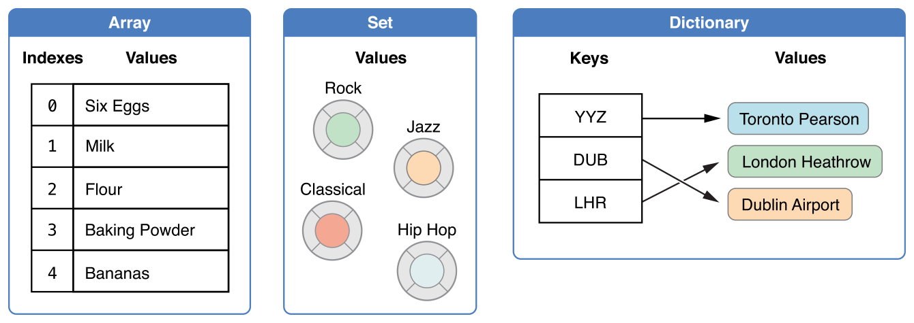
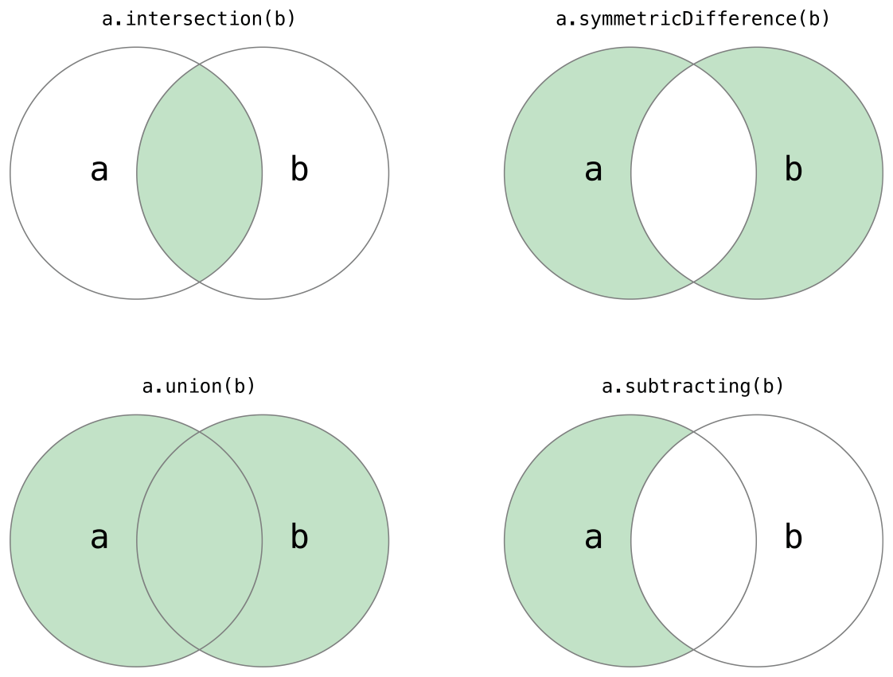
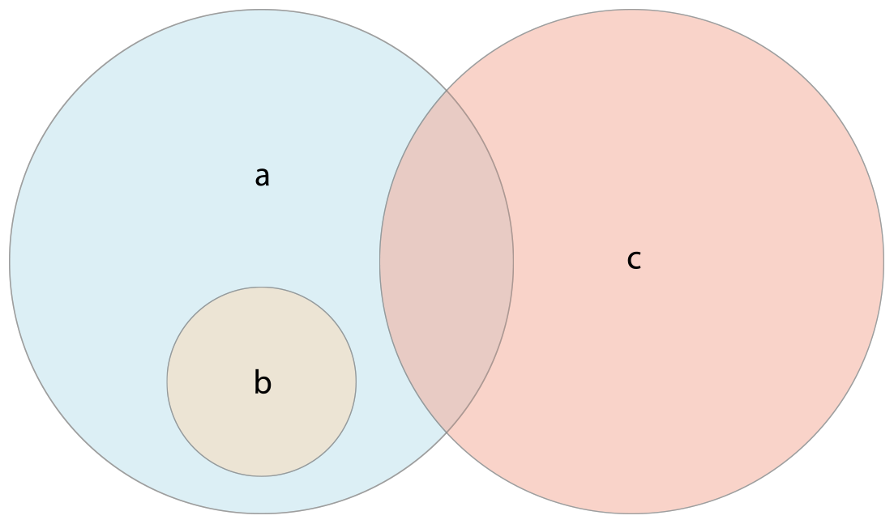

# 콜렉션 타입 \(Collection Types\)

Swift에서는 콜렉션 타입으로 배열, 셋, 사전 세 가지를 지원합니다.



## 콜렉션의 변경

배열, 셋, 사전을 변수\(var\)에 할당하면 이 콜렉션은 변경가능하고 상수\(let\)에 할당하면 변경 불가능 합니다.

## 배열\(Array\)

### 배열의 축약형 문법

배열 타입은 Array로 적을 수 있는데 축약형으로 \[Element\] 형태로 사용할 수도 있습니다.

### 빈 배열의 생성

아래와 같이 Int형 빈 배열을 생성할 수 있습니다.

```swift
var someInts = [Int]()
print("someInts is of type [Int] with \(someInts.count) items.")
// someInts is of type [Int] with 0 items.
```

```swift
someInts.append(3)
// 배열에 3을 추가 했습니다.
someInts = []
// 배열을 비웠습니다. 배열의 아이템 타입은 그대로 Int로 유지됩니다.
```

### 기본 값으로 빈 배열 생성

repeating 메소드와 count 메소드를 이용해 기본 값으로 빈 배열을 생성할 수 있습니다.

```swift
var threeDoubles = Array(repeating: 0.0, count: 3)
// threeDoubles : Double 타입의 [0.0, 0.0, 0.0]
```

### 다른 배열을 추가한 배열의 생성

`+` 연산자를 이용해 배열을 합칠 수 있습니다.

```swift
var anotherThreeDoubles = Array(repeating: 2.5, count: 3)
// anotherThreeDoubles : [2.5, 2.5, 2.5]

var sixDoubles = threeDoubles + anotherThreeDoubles
// sixDoubles : [0.0, 0.0, 0.0, 2.5, 2.5, 2.5]
```

### 리터럴을 이용한 배열의 생성

`[value 1, value 2, value 3]` 형태를 이용해 배열을 생성할 수 있습니다.

```swift
var shoppingList: [String] = ["Eggs", "Milk"]
```

더 간단하게 선언할 수도 있습니다.

```swift
var shoppingList = ["Eggs", "Milk"]
```

### 배열의 접근 및 변환

배열의 원소 개수 확인

```swift
print("The shopping list contains \(shoppingList.count) items.")
// The shopping list contains 2 items.
```

배열이 비었는지 확인

```swift
if shoppingList.isEmpty {
    print("The shopping list is empty.")
} else {
    print("The shopping list is not empty.")
}
// The shopping list is not empty.
```

배열에 원소 추가

```swift
shoppingList.append("Four")
// shoppingList.count = 3
```

```swift
shoppingList += ["Baking Powder"]
// shoppingList.count = 4
shoppingList += ["Chocolate Spread", "Cheese", "Butter"]
// shoppingList.count = 7
```

배열의 특정 위치의 원소 접근

```swift
var firstItem = shoppingList[0]
// firstItem : "Eggs"
```

```swift
shoppingList[4..6] = ["Bananas", "Apples"]
// 4, 5, 6번째 인덱스 아이템을 Banana, Apples로 변환
// 즉, 아이템 3개가 2개로 줄었다.
```

특정 위치에 원소 추가/삭제/접근

```swift
shoppingList.insert("Maple Syrup", at:0)
```

```swift
let mapleSyrup = shoppingList.remove(at: 0)
```

```swift
firstItem = shoppingList[0]
// firstItem : "Six eggs"
```

```swift
let apples = shoppingList.removeLast()
```

### 배열의 순회

`for-in` loop을 이용해 배열을 순회할 수 있습니다.

```swift
for item in shoppingList {
    print(item)
}
// Six eggs
// Milk
// Flour
// Baking Powder
// Bananas
```

배열의 값과 인덱스가 필요할 때는 `enumerated()` 메소드를 사용합니다.

```swift
for (index, value) in shoppingList.enumerated() {
    print("Item \(index + 1): \(value)")
}
// Item 1: Six eggs
// Item 2: Milk
// Item 3: Flour
// Item 4: Baking Powder
// Item 5: Bananas
```

## 셋\(Sets\)

`Set` 형태로 저장되기 위해서는 반드시 타입이 `hashable`이어야만 합니다. Swift에서 `String`, `Int`, `Double`, `Bool` 같은 기본 타입은 기본적으로 `hashable`입니다. Swift에서 `Set` 타입은 `Set`으로 선언합니다.

### 빈 Set 생성

```swift
var letters = Set<Character>()
print("letters is of type Set<Character> with \(letters.count) items.")
// letters is of type Set<Character> with 0 items.
```

```swift
letters.insert("a")
letters = []
```

### 배열 리터럴을 이용한 Set 생성

```swift
var favoriteGenres: Set<String> = ["Rock", "Classical", "Hip hop"]
```

Swift의 타입추론으로 아래와 같이 선언도 가능합니다.

```swift
var favoriteGenres: Set = ["Rock", "Classical", "Hip hop"]
```

### Set의 접근과 변경

```swift
print("I have \(favoriteGenres.count) favorite music genres.")
// I have 3 favorite music genres.
```

비었는지 확인

```swift
if favoriteGenres.isEmpty {
    print("As far as music goes, I'm not picky.")
} else {
    print("I have particular music preferences.")
}
// I have particular preferences.
```

추가

```swift
favoriteGenres.insert("Jazz")
```

삭제

```swift
if let removedGenre = favoriteGenres.remove("Rock") {
    print("\(removedGenre)? I'm over it.")
} else {
    print("I never much cared for that.")
}
// Rock? I'm over it.
```

값 확인

```swift
if favoriteGenres.contains("Funk") {
    print("I get up on the good foot.")
} else {
    print("It's too funky in here.")
}
// It's too funky in here.
```

### Set의 순회

for-in loop을 이용해 set을 순회할 수 있습니다.

```swift
for genre in favoriteGenres {
    print("\(genre)")
}
// Classical
// Hip hop
// Jazz
```

### Set 명령



```swift
let oddDigits: Set = [1, 3, 5, 7, 9]
let evenDigits: Set = [0, 2, 4, 6, 8]
let singleDigitPrimeNumbers: Set = [2, 3, 5, 7]

oddDigits.union(evenDigits).sorted()
// [0, 1, 2, 3, 4, 5, 6, 7, 8, 9]
oddDigits.intersection(evenDigits).sorted()
// []
oddDigits.subtracting(singleDigitPrimeNumbers).sorted()
// [1, 9]
oddDigits.symmetricDifference(singleDigitPrimeNumbers).sorted()
// [1, 2, 9]
```

### Set의 맴버십과 동등 비교

Set의 동등비교와 맴버 여부를 확인하기 위해 각각 `==` 연산자와 `isSuperset(of:)`, `isStrictSubset(of:)`, `isStrictSuperset(of:)`, `isDisjoint(with:)` 메소드를 사용합니다.



`isDisjoint(with:)`는 둘간의 공통값이 없는 경우에 `true`를 반환합니다.

```swift
let houseAnimals: Set = ["🐶", "🐱"]
let farmAnimals: Set = ["🐮", "🐔", "🐑", "🐶", "🐱"]
let cityAnimals: Set = ["🐦", "🐭"]

houseAnimals.isSubset(of: farmAnimals)
// 참
farmAnimals.isSuperset(of: houseAnimals)
// 참
farmAnimals.isDisjoint(with: cityAnimals)
// 참
```

## 사전\(Dictionaries\)

> _주의_  
> Swift의 `Dictionary`타입은 `Foundation` 클래스의 `NSDictionary`를 bridge한 타입입니다.

### 축약형 Dictionary

\[Key: Value\] 형태로 Dictionary를 선언해 사용할 수 있습니다.

### 빈 Dictionary의 생성

```swift
var namesOfIntegers = [Int: String]()
```

```swift
namesOfIntegers[16] = "sixteen"
namesOfIntegers = [:]
// 빈 사전
```

### 리터럴를 이용한 Dictionary의 생성

`[key 1: value 1, key 2: value 2, key 3: value 3]` 형태로 사전을 선언할 수 있습니다.

```swift
var airports: [String: String] = = ["YYZ": "Toronto Pearson", "DUB": "Dublin"]
```

### Dictionary의 접근과 변경

```swift
print("The airports dictionary contains \(airports.count) items.")
// The airports dictionary contains 2 items.
```

빈 Dictionary 확인

```swift
if airports.isEmpty {
    print("The airports dictionary is empty.")
} else {
    print("The airports dictionary is not empty.")
}
// The airports dictionary is not empty.
```

값 할당

```swift
airports["LHR"] = "London"
// the airports dictionary now contains 3 items
```

