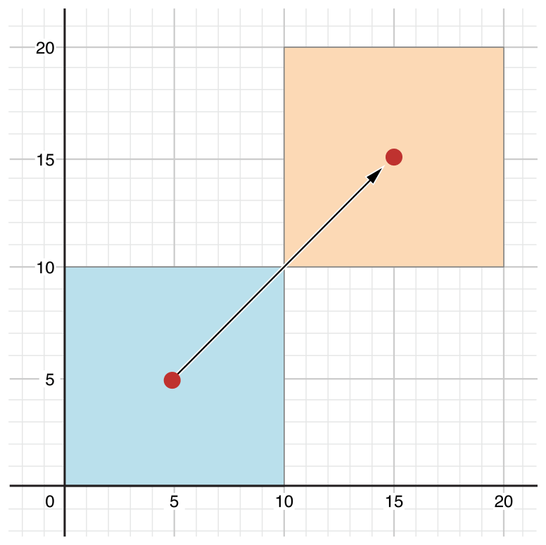
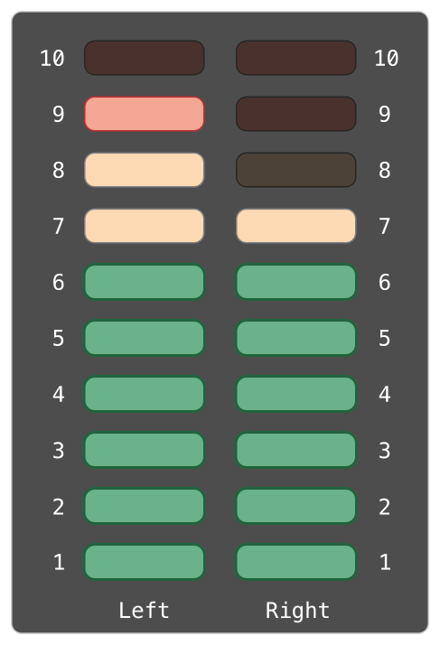

# 프로퍼티 \(Properties\)

프로퍼티는 클래스, 구조체, 열거형과 관련한 값입니다. 프로퍼티의 종류에는 저장 프로퍼티\(Stored Properties\)와 계산된 프로퍼티\(Computed Properties\)가 있습니다. 저장 프로퍼티는 말 그대로 값을 저장하고 있는 프로퍼티이고, 계산된 프로퍼티는 값을 저장하고 있지 않고 특정하게 계산한 값을 반환해 주는 프로퍼티입니다. 계산된 프로퍼티는 클래스, 구조체, 열거형 모두에서 사용가능하지만, 저장 프로퍼티는 클래스와 구조체에서만 사용 가능합니다. 추가로 프로퍼티 옵저버를 정의해서 값이 변할 때마다 모니터링할 수 있습니다.

## 저장 프로퍼티 \(Stored Properties\)

저장 프로퍼티는 위에서 설명한 대로 단순히 값을 저장하고 있는 프로퍼티 입니다. 이 프로퍼티는 `let`키워드를 이용해서 상수 혹은 `var`키워드를 이용해서 변수로 선언해 사용할 수 있습니다.

```swift
struct FixedLengthRange {
    var firstValue: Int
    let length: Int
}
var rangeOfThreeItems = FixedLengthRange(firstValue: 0, length: 3)
// 범위 값은 0, 1, 2 입니다.
rangeOfThreeItems.firstValue = 6
// 범위 값은 6, 7, 8 입니다.
```

위 예제를 보면 `firstValue`와 `length` 에 첫 값과 그 길이를 각각의 프로퍼티에 저장해 범위 값을 표현합니다.

### 상수 구조체 인스턴스의 저장 프로퍼티 \(Stored Properties of Constant Structure Instances\)

구조체를 상수로 선언하면\(`let`\) 그 구조체 인스턴스의 프로퍼티를 변경할 수 없습니다.

```swift
let rangeOfFourItems = FixedLengthRange(firstValue: 0, length: 4)
// 범위 값은 0, 1, 2, 3 입니다.
rangeOfFourItems.firstValue = 6
// 에러 발생!
```

위 예제에서 `rangeOfFourItems`는 상수\(`let`\)로 선언되었기 때문에 프로퍼티를 변경할 수 없습니다. 반면 구조체가 아니라 클래스는 `let`으로 선언하더라도 프로퍼티가 변경 가능합니다. 이유는 클래스 인스턴스는 참조 타입 이기 때문입니다.

### 지연 저장 프로퍼티 \(Lazy Stored Properties\)

지연 저장 프로퍼티는 값이 처음으로 사용 되기 전에는 계산되지 않는 프로퍼티입니다. 지연 저장 프로퍼티로 선언하기 위해서는 프로퍼티의 선언 앞에 `lazy` 키워드를 붙이면 됩니다.

> NOTE  
> 지연 프로퍼티는 반드시 변수\(`var`\)로 선언해야 합니다. 왜냐하면 상수는 초기화가 되기전에 항상 값을 같는 프로퍼티인데, 지연 프로퍼티는 처음 사용되기 전에는 값을 갖지 않는 프로퍼티이기 때문입니다.

지연 프로퍼티는 프로퍼티가 특정 요소에 의존적이어서 그 요소가 끝나기 전에 적절한 값을 알지 못하는 경우에 유용합니다. 또 복잡한 계산이나 부하가 많이 걸리는 작업을 지연 프로퍼티로 선언해 사용하면 실제 사용되기 전에는 실행되지 않아서 인스턴스의 초기화 시점에 복잡한 계산을 피할 수 있습니다.

예제를 보시겠습니다.

```swift
class DataImporter {
    /*
        DataImporter는 외부 파일에서 데이터를 가져오는 클래스입니다.
         이 클래스는 초기화 하는데 매우 많은 시간이 소요된다고 가정하겠습니다.
     */
    var filename = "data.txt"
    // 데이터를 가져오는 기능의 구현이 이 부분에 구현돼 있다고 가정
}

class DataManager {
    lazy var importer = DataImporter()
    var data = [String]()
    // 데이터를 관리하는 기능이 이 부분에 구현돼 있다고 가정
}

let manager = DataManager()
manager.data.append("Some data")
manager.data.append("Some more data")
// DataImporter 인스턴스는 이 시점에 생성돼 있지 않습니다.
```

`DataManager`라는 클래스를 선언하고 이 클래스는 데이터를 가져오는 `DataImporter`클래스를 갖고 있습니다. 그리고 이 `DataImporter`는 실제 디스크 파일에서 데이터를 가져오기 때문에 초기화시 많은 시간이 소요됩니다. 그래서 이 클래스를 지연 프로퍼티\(`lazy var importer = DataImporter()`\) 로 선언합니다. 이 프로퍼티는 코드에서 볼 수 있듯 `DataManager` 인스턴스 `manager`를 생성하고 거기에 data 를 넣어도 그 시점에 `DataImporter`인스턴스는 생성돼 있지 않습니다. 다시 말하면 지연 프로퍼티로 선언해 놓았기 때문에 실제 그 프로퍼티를 사용하기 전에는 복잡하고 시간일 오래 소요되는 연산을 할 필요가 없다는 것입니다.

```swift
print(manager.importer.filename)
// the DataImporter 인스턴스가 생성되었습니다.
// "data.txt" 파일을 출력합니다.
```

`manager.importer.filename`가 실행돼 실제 `importer` 프로퍼티에 처음 접근할 때 비로소 `importer`인스턴스는 생성됩니다.

> NOTE  
> 만약 지연 프로퍼티가 여러 스레드에서 사용되면 지연 프로퍼티가 한번만 실행되는 걸 보장하지 않습니다. 만약 지연 프로퍼티가 단일 스레드에서 사용되면 초기화는 한번만 하게 됩니다.

### 저장 프로퍼티와 인스턴스 변수 \(Stored Properties and Instance Variables\)

Objective-C에 경험이 있으신 분은 Objective-C 언어에서는 값을 저장하기 위해 점 연산자\(`instance.property = value`\)나 set 연산\(`instance.setProperty(value)`\)으로 값을 저장한다는 것을 아실 겁니다. 뿐만 아니라 메모리 관리와 관련한 개념도 프로퍼티에 함께 명시합니다. 바로 이런식으로 말이죠. `@property (nonatomic, retain) NSString *propertyName;` Swift에서는 이런 컨셉을 하나의 프로퍼티애 녹여 프로퍼티의 선언과 사용의 혼란을 피했습니다. 프로퍼티의 이름, 타입, 메모리 관리 등의 모든 정보를 프로퍼티를 선언하는 한곳에서 정의하게 됩니다.

## 계산된 프로퍼티 \(Computed Properties\)

저장 프로퍼티를 뿐 아니라 추가적으로 클래스, 구조체, 열거형은 계산된 프로퍼티를 선언할 수 있습니다. 이 계산된 프로퍼티는 실제 값을 저장하고 있는 것이 아니라 `getter`와 `optional한 setter`를 제공해 값을 탐색하고 간접적으로 다른 프로퍼티 값을 설정할 수 있는 방법을 제공합니다.

```swift
struct Point {
    var x = 0.0, y = 0.0
}
struct Size {
    var width = 0.0, height = 0.0
}
struct Rect {
    var origin = Point()
    var size = Size()
    var center: Point {
        get {
            let centerX = origin.x + (size.width / 2)
            let centerY = origin.y + (size.height / 2)
            return Point(x: centerX, y: centerY)
        }
        set(newCenter) {
            origin.x = newCenter.x - (size.width / 2)
            origin.y = newCenter.y - (size.height / 2)
        }
    }
}
var square = Rect(origin: Point(x: 0.0, y: 0.0),
                  size: Size(width: 10.0, height: 10.0))
let initialSquareCenter = square.center
square.center = Point(x: 15.0, y: 15.0)
print("square.origin is now at (\(square.origin.x), \(square.origin.y))")
// "square.origin is now at (10.0, 10.0)" 출력
```

위 코드는 좌표와 크기를 갖는 사각형을 표현하는 구조체에 관한 코드입니다. 여기서 `Rect`구조체는 사각형의 중점을 표현하는 `center`라는 계산된 프로퍼티를 제공합니다. 이 프로퍼티는 계산된 프로퍼티의 정의대로 값을 직접 갖고 있는 것이 아니라 다른 좌표와 크기 프로퍼티들을 적절히 연산해서 구할 수 있습니다.\(`get`\). 또 `set` 으로 사각형의 중점을 직접 설정할 수 있는데, 이 값을 설정할 때 `x, y`좌표가 어떤 값을 가져야 하는지 계산해서 `x, y`에 적절한 좌표값을 넣어 줍니다.



### Setter 선언의 간략한 표현 \(Shorthand Setter Declaration\)

앞의 코드에서는 `Setter`의 인자 이름을 아래와 같이 `set(newCenter)`라고 명시했지만, 만약 이렇게 `(newCenter)`라고 인자 이름을 지정하지 않으면 인자 기본 이름인 `newValue`를 사용할 수 있습니다.

```swift
struct AlternativeRect {
    var origin = Point()
    var size = Size()
    var center: Point {
        get {
            let centerX = origin.x + (size.width / 2)
            let centerY = origin.y + (size.height / 2)
            return Point(x: centerX, y: centerY)
        }
        set {
            origin.x = newValue.x - (size.width / 2)
            origin.y = newValue.y - (size.height / 2)
        }
    }
}
```

위 코드에서는 `set` 메소드 안에서 인자 이름을 지정하지 않았는데도 `newValue.x`, `newValue.y`를 사용할 수 있는 것을 보실 수 있습니다.

### 읽기전용 계산된 프로퍼티 \(Read-Only Computed Properties\)

`getter`만 있고 `setter`를 제공하지 않는 계산된 프로퍼티를 읽기전용 계산된 프로퍼티라고 합니다. 즉, 읽기전용 계산된 프로퍼티는 반드시 반환 값을 제공하고 다른 값을 지정할 수는 없는 프로퍼티 입니다.

> NOTE  
> 읽기전용 계산된 프로퍼티를 포함해 계산된 프로퍼티를 선언시에는 반드시 `let`이 아니라 `var`로 선언해야합니다. 보통 읽기전용\(read-only\)이라 함은 한번 값이 정해지면 변하지 않기 때문에 `let`으로 선언하는 것이 맞으나 계산된 프로퍼티는 읽기전용\(read-only\)이라 하더라도 계산 값에 따라 값이 변할 수 있기 때문에 `var`로 선언합니다.

다음 코드는 `volume`이라는 읽기전용 계산된 프로퍼티를 사용한 \(예\)입니다.

```swift
struct Cuboid {
    var width = 0.0, height = 0.0, depth = 0.0
    var volume: Double {
        return width * height * depth
    }
}
let fourByFiveByTwo = Cuboid(width: 4.0, height: 5.0, depth: 2.0)
print("the volume of fourByFiveByTwo is \(fourByFiveByTwo.volume)")
// "the volume of fourByFiveByTwo is 40.0" 출력
```

## 프로퍼티 옵저버 \(Property Observers\)

프로퍼티에는 새 값이 설정\(set\) 될 때마다 이 이벤트를 감지할 수 있는 옵저버를 제공합니다. 이 옵저버를 프로퍼티 옵저버라 하는데 프로퍼티 옵저버는 새 값이 이전 값과 같더라도 항상 호출 됩니다. 이 프로퍼티 옵저버는 지연 저장 프로퍼티\(`lazy stored properties` 에서는 사용할 수 없습니다. 서브클래스의 프로퍼티에 옵저버를 정의하는 것도 가능합니다. 계산된 프로퍼티는 `setter`에서 값의 변화를 감지 할 수 있기 때문에 따로 옵저버를 정의할 필요가 없습니다. 프로퍼티에서는 다음 두가지 옵저버를 제공합니다.

* `willSet` : 값이 저장되기 바로 직전에 호출 됨
* `didSet` : 새 값이 저장되고 난 직후에 호출 됨

  `willSet`에서는 새 값의 파라미터명을 지정할 수 있는데, 지정하지 않으면 기본 값으로 `newValue`를 사용합니다.

  `didSet`에서는 바뀌기 전의 값의 파라미터명을 지정할 수 있는데, 지정하지 않으면 기본 값으로 `oldValue`를 사용합니다.

> NOTE  
> 서브클래스에서 특정 프로퍼티의 값을 설정했을 때, 수퍼클래스의 초기자\(initializer\)가 호출 된 후 `willSet`, `didSet` 프로퍼티 옵저버가 실행됩니다. 수퍼클래스에서 프로퍼티를 변경하는 것도 마찬가지로 수퍼클래스의 초기자가 호출된 후 옵저버가 실행됩니다.

프로퍼티 옵저버 관련한 예제를 보시겠습니다.

```swift
class StepCounter {
    var totalSteps: Int = 0 {
        willSet(newTotalSteps) {
            print("About to set totalSteps to \(newTotalSteps)")
        }
        didSet {
            if totalSteps > oldValue  {
                print("Added \(totalSteps - oldValue) steps")
            }
        }
    }
}
let stepCounter = StepCounter()
stepCounter.totalSteps = 200
// About to set totalSteps to 200
// Added 200 steps
stepCounter.totalSteps = 360
// About to set totalSteps to 360
// Added 160 steps
stepCounter.totalSteps = 896
// About to set totalSteps to 896
// Added 536 steps
```

프로퍼티 옵저버 `willSet`과 `didSet`을 사용한 것을 보실 수 있습니다. `willSet`에서는 새로운 값의 파라미터명으로 `newTotalSteps`를 지정해서 사용했고, `didSet`에서는 변하기 전의 값을 의미하는 파라미터명을 지정하지 않고 `oldValue`라는 기본 파라미터명을 이용한 것을 할 수 있습니다. 실행 결과 로그를 보시면 값이 변하기 전과 변하고 나서 호출된 로그를 보며 프로퍼티 값 설정시 `willSet`과 `didSet`이 호출되는 순서를 확인하실 수 있습니다.

> NOTE  
> 만약 in-out 파라미터로 선언된 함수의 인자에 프로퍼티를 넘기면 `willSet`과 `didSet`이 항상 실행됩니다. 이유는 in-out 파라미터이기 때문에 프로퍼티가 항상 복사\(copy\)되기 때문입니다. 이 in-out 파라미터의 프로퍼티는 항상 원래 값에 새 값을 다시 덮어쓰게 됩니다.

## 전역변수와 지역변수 \(Global and Local Variables\)

앞서 소개한 계산된 프로퍼티와 프로퍼티 옵저버 기능은 전역변수와 지역변수 모두에서 이용 가능합니다. 전역 변수란 함수, 메소드, 클로저 혹은 타입 컨텍스트 밖에 정의된 변수이고 지역 변수는 그 안에 선언된 변수를 말합니다.

> NOTE  
> 전역 상수와 변수는 지연 저장 프로퍼티\(Lazy Stored Properties\)와 같이 지연 계산\(lazy computed\) 됩니다. 하지만 지연 저장 프로퍼티와 다르게 `lazy`키워드를 붙일 필요 없습니다. 반면 지역 상수와 변수는 지연 계산될 수 없습니다.

## 타입 프로퍼티 \(Type Properties\)

인스턴스 프로퍼티는 특정 인스턴스에 속한 프로퍼티를 말합니다. 이 프로퍼티는 새로운 인스턴스가 생성될 때마다 새로운 프로퍼티도 같이 생성됩니다. 타입 프로퍼티는 특정 타입에 속한 프로퍼티로 그 타입에 해당하는 단 하나의 프로퍼티만 생성됩니다. 이 타입 프로퍼티는 특정 타입의 모든 인스턴스에 공통으로 사용되는 값을 정의할때 유용합니다.

> NOTE  
> 인스턴스 프로퍼티와는 다르게 타입 프로퍼티는 항상 초기값을 지정해서 사용해야 합니다. 왜냐하면 타입 자체에는 초기자\(Initializer\)가 없어 초기화 할 곳이 없기 때문입니다.

### 타입 프로퍼티 구문 \(Type Property Syntax\)

타입 프로퍼티를 선언을 위해서는 `static` 키워드를 사용합니다. 클래스에서는 `static`과 `class` 이렇게 2가지 형태로 타입 프로퍼티를 선언할 수 있는데 두 가지 경우의 차이는서브클래스에서 `overriding`가능 여부입니다. `class`로 선언된 프로퍼티는 서브클래스에서 오버라이드 가능합니다. 구조체, 열거형, 클래스에서의 타입 프로퍼티 선언의 \(예\)는 다음과 같습니다.

```swift
struct SomeStructure {
    static var storedTypeProperty = "Some value."
    static var computedTypeProperty: Int {
        return 1
    }
}
enum SomeEnumeration {
    static var storedTypeProperty = "Some value."
    static var computedTypeProperty: Int {
        return 6
    }
}
class SomeClass {
    static var storedTypeProperty = "Some value."
    static var computedTypeProperty: Int {
        return 27
    }
    class var overrideableComputedTypeProperty: Int {
        return 107
    }
}
```

> NOTE  
> 위의 계산된 타입 프로퍼티의 \(예\)는 읽기전용이지만, 같은 문법으로 계산된 인스턴스 타입 프로퍼티에서는 읽고 쓸 수 있는 프로퍼티로 사용할 수 있습니다.

### 타입 프로퍼티의 접근과 설정 \(Querying and Setting Type Properties\)

인스턴스 프로퍼티와 마찬가지로 타입 프로퍼티도 점연산자\(dot operator\)로 프로퍼티의 값을 가져오고 할당할 수 있습니다. 관련 \(예\)는 다음과 같습니다.

```swift
print(SomeStructure.storedTypeProperty)
// Prints "Some value."
SomeStructure.storedTypeProperty = "Another value."
print(SomeStructure.storedTypeProperty)
// Prints "Another value."
print(SomeEnumeration.computedTypeProperty)
// Prints "6"
print(SomeClass.computedTypeProperty)
// Prints "27"
```



다음 예제 코드는 오디오 채널의 볼륨을 조절하고 관리하는 구조체 입니다.

```swift
struct AudioChannel {
    static let thresholdLevel = 10
    static var maxInputLevelForAllChannels = 0
    var currentLevel: Int = 0 {
        didSet {
            if currentLevel > AudioChannel.thresholdLevel {
                // cap the new audio level to the threshold level
                currentLevel = AudioChannel.thresholdLevel
            }
            if currentLevel > AudioChannel.maxInputLevelForAllChannels {
                // store this as the new overall maximum input level
                AudioChannel.maxInputLevelForAllChannels = currentLevel
            }
        }
    }
}
```

현재 오디오의 최대 볼륨의 크기는 타입 프로퍼티 `maxInputLevelForAllChannels`로 관리하고 그 값은 `thresholdLevel`로 상수로 정의돼 있어서 현재 정도\(currentLevel\)을 설정할 때마다\(`didSet`\) 채널별 볼륨이 최대 그 값을 넘지 못하도록 조정합니다.

> NOTE  
> `currentLevel`의 `didSet`안에서 `currentLevel`에 값을 할당하는 것은 `didSet`을 반복호출하지 않습니다.

이렇게 만든 오디오 채널 구조체를 이용해 좌우 두개의 오디오 채널을 생성할 수 있습니다.

```swift
var leftChannel = AudioChannel()
var rightChannel = AudioChannel()
```

왼쪽 채널에 7 값을 할당 합니다.

```swift
leftChannel.currentLevel = 7
print(leftChannel.currentLevel)
// Prints "7"
print(AudioChannel.maxInputLevelForAllChannels)
// Prints "7"
```

오른쪽 채널에서 최대 값으로 설정한 값을 넘는 11을 할당해 보겠습니다.

```swift
rightChannel.currentLevel = 11
print(rightChannel.currentLevel)
// Prints "10"
print(AudioChannel.maxInputLevelForAllChannels)
// Prints "10"
```

`thresholdLevel`이 적용돼서 11을 입력했지만 10으로 설정된 것을 확인할 수 있습니다.

