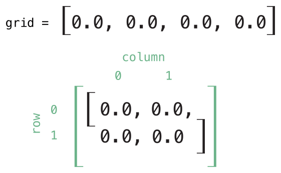
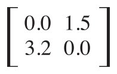

# 서브스크립트 \(Subscripts\)

클래스, 구조체 그리고 열거형에서 스크립트를 정의해 사용할 수 있습니다. 서브스크립트란 콜렉션, 리스트, 시퀀스 등 집합의 특정 멤버 엘리먼트에 간단하게 접근할 수 있는 문법입니다. 서브스크립트를 이용하면 추가적인 메소드 없이 특정 값을 할당\(assign\)하거나 가져올 수\(retrieve\) 있습니다. 예를들면, 배열\(Array\) 인스턴스의 특정 엘리먼트는 `someArray[index]`문법으로, 사전\(Dictionary\) 인스턴스의 특정 엘리먼트는 `someDictionary[key]`로 접근할 수 있습니다. 하나의 타입에 여러 서브스크립트를 정의할 수 있고 오버로드\(Overload\)도 가능합니다. 뿐만아니라 단일 인자 값을 넘어, 필요 따라 복수 인자 값을 사용할 수 있습니다.

## 서브스크립트 문법 \(Subscript Syntax\)

서브스크립트 선언 문법은 인스턴스 메소드와 계산된 프로퍼티를 선언하는 것과 비슷합니다. 인스턴스 메소드와 다른 점은, 서브스크립트는 읽고-쓰기\(read-write\) 혹은 읽기 전용\(read only\)만 가능하다는 것입니다. 정의는 계산된 프로퍼티 방식과 같이 `setter`, `getter` 방식을 따릅니다.

```swift
subscript(index: Int) -> Int {
    get {
        // 적절한 반환 값
    }
    set(newValue) {
        // 적절한 set 액션
    }
}
```

서브스크립트의 `set`에 대한 인자 값을 따로 지정하지 않으면 기본 값\(default value\)로 `newValue`를 사용합니다. 읽기 전용으로 선언하려면 `get`, `set`을 지우고 따로 지정하지 않으면 `get`으로 동작하게 되서 읽기 전용으로 선언됩니다.

```swift
subscript(index: Int) -> Int {
    // 적절한 반환 값
}
```

다음은 읽기 전용으로 선언한 서브스크립트의 \(예\)입니다.

```swift
struct TimesTable {
    let multiplier: Int
    subscript(index: Int) -> Int {
        return multiplier * index
    }
}
let threeTimesTable = TimesTable(multiplier: 3)
print("six times three is \(threeTimesTable[6])")
// "six times three is 18" 출력
```

`TimesTable`구조체의 `multiplier`를 3으로 설정하고 `threeTimesTable[6]`에서 6번째 값, 여기서는 3에 6을 곱한 값을 출력합니다.

## 서브스크립트 사용 \(Subscript Usage\)

다음은 사전에서 서브스크립트의 사용 \(예\) 입니다.

```swift
var numberOfLegs = ["spider": 8, "ant": 6, "cat": 4]
numberOfLegs["bird"] = 2
```

`numberOfLegs`값은 타입 추론에 의해 `[String: Int]`형을 갖습니다. `numberOfLegs["bird"] = 2`는 사전형 변수 `numberOfLegs`에 key로 bird를 그 값은 2를 넣으라는 서브스크립트 문법입니다.

> NOTE  
> 사전의 반환 값은 옵셔널입니다. 그 이유는 사전에 특정 키 값이 없는 경우가 있을 수 있고, 특정 키 값을 nil로 설정할 수 있기 때문입니다.

### 서브스크립트 옵션 \(Subscript Options\)

서브스크립트는 입력 인자의 숫자에 제한이 없고, 입력 인자의 타입과 반환 타입의 제한도 없습니다. 다만 in-out 인자\(in-out parameter\)나 기본 인자 값\(default parameter value\)을 제공할 수는 없습니다. 서브스크립트는 오버로딩도 허용합니다. 그래서 인자형, 반환형에 따라 원하는 수 만큼의 서브스크립트를 선언할 수 있습니다. 다음은 서브스크립트를 이용해 다차원 행열을 선언하고 접근하는 \(예\) 입니다.

```swift
struct Matrix {
    let rows: Int, columns: Int
    var grid: [Double]
    init(rows: Int, columns: Int) {
        self.rows = rows
        self.columns = columns
        grid = Array(repeating: 0.0, count: rows * columns)
    }
    func indexIsValid(row: Int, column: Int) -> Bool {
        return row >= 0 && row < rows && column >= 0 && column < columns
    }
    subscript(row: Int, column: Int) -> Double {
        get {
            assert(indexIsValid(row: row, column: column), "Index out of range")
            return grid[(row * columns) + column]
        }
        set {
            assert(indexIsValid(row: row, column: column), "Index out of range")
            grid[(row * columns) + column] = newValue
        }
    }
}
```

위 코드에서는 `subscript(row: Int, column: Int) -> Double`코드와 같이 row, column 2개의 인자를 받고, Double를 반환하는 서브스크립트를 선언했습니다. get, set 각각에 `indexIsValid`메소드를 사용해서 유효한 인덱스가 아닌경우 프로그램이 바로 종료 되도록 `assert`를 호출했습니다. 선언한 서브스크립트 문법을 이용해 `var matrix = Matrix(rows: 2, columns: 2)` 2 x 2 행렬을 선언합니다.



grid 배열은 서브스크립트에 의해 위와 같이 row와 column을 갖는 행렬도 동작합니다. 행렬에 서브스크립트를 이용해 특정 row/column에 값을 넣을 수 있습니다.

```swift
matrix[0, 1] = 1.5
matrix[1, 0] = 3.2
```

값을 넣은 결과 행렬은 다음과 같은 모습이 됩니다.



행렬의 입출력시 row/column의 범위가 적절한지 아래의 코드로 확인합니다.

```swift
func indexIsValid(row: Int, column: Int) -> Bool {
    return row >= 0 && row < rows && column >= 0 && column < columns
}
```

만약 적절한 범위를 벗어나면 assert가 실행됩니다.

```swift
let someValue = matrix[2, 2]
// [2, 2]가 사용할 수 있는 행렬의 범위를 벗어나므로 assert가 실행됩니다.
```

